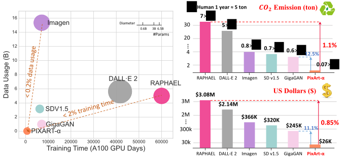
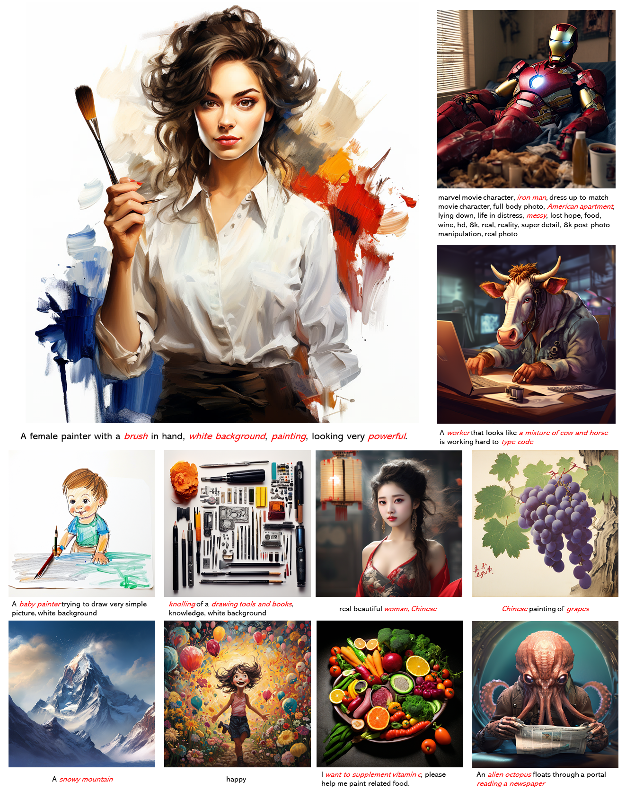
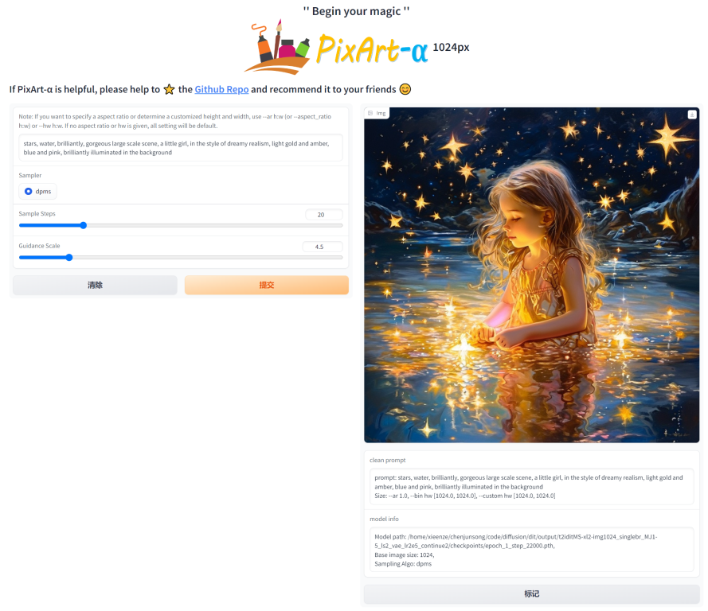
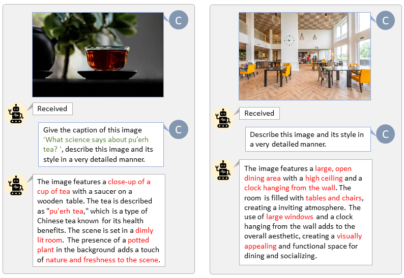

<p align="center">
  
</p>


### <div align="center">👉 PixArt-α: Fast Training of Diffusion Transformer for Photorealistic Text-to-Image Synthesis <div> 

<div align="center">
  <a href="https://pixart-alpha.github.io/"></a> &ensp;
  <a href="https://huggingface.co/docs/diffusers/main/en/api/pipelines/pixart"></a> &ensp;
  <a href="https://huggingface.co/spaces/PixArt-alpha/PixArt-alpha"></a> &ensp;
  <a href="https://openxlab.org.cn/models/detail/PixArt-alpha/PixArt-alpha"></a> &ensp;
  <a href="https://colab.research.google.com/drive/1jZ5UZXk7tcpTfVwnX33dDuefNMcnW9ME?usp=sharing"></a> &ensp;
  <a href="https://arxiv.org/abs/2310.00426"></a> &ensp;
</div>

---

This repo contains PyTorch model definitions, pre-trained weights and inference/sampling code for our paper exploring 
Fast training diffusion models with transformers. You can find more visualizations on our [project page](https://pixart-alpha.github.io/).

> [**PixArt-α: Fast Training of Diffusion Transformer for Photorealistic Text-to-Image Synthesis**](https://pixart-alpha.github.io/)<br>
> [Junsong Chen*](https://lawrence-cj.github.io/), [Jincheng Yu*](https://lovesykun.cn/about.html), 
> [Chongjian Ge*](https://chongjiange.github.io/), [Lewei Yao*](https://scholar.google.com/citations?user=hqDyTg8AAAAJ&hl=zh-CN&oi=ao),
> [Enze Xie](https://xieenze.github.io/)&#8224;,
> [Yue Wu](https://yuewuhkust.github.io/), [Zhongdao Wang](https://zhongdao.github.io/), 
> [James Kwok](https://www.cse.ust.hk/~jamesk/), [Ping Luo](http://luoping.me/), 
> [Huchuan Lu](https://scholar.google.com/citations?hl=en&user=D3nE0agAAAAJ), 
> [Zhenguo Li](https://scholar.google.com/citations?user=XboZC1AAAAAJ)
> <br>Huawei Noah’s Ark Lab, Dalian University of Technology, HKU, HKUST<br>

---

## 🚩 **New Features/Updates**
- ✅ Nov. 21, 2023. 💥 [SA-Sovler](https://arxiv.org/abs/2309.05019) official code first release [here](asset/docs/sasolver.md).
- ✅ Nov. 19, 2023. Release `PixArt + Dreambooth` training scripts.
- ✅ Nov. 16, 2023. Diffusers support `random resolution` and `batch images` generation now. Besides, 
running `Pixart` in under 8GB GPU VRAM is available in 🧨 [diffusers](https://github.com/huggingface/diffusers/blob/docs/8bit-inference-pixart/docs/source/en/api/pipelines/pixart.md).
- ✅ Nov. 10, 2023. Support DALL-E 3 Consistency Decoder in 🧨 diffusers.
- ✅ Nov. 06, 2023. Release pretrained weights with 🧨 diffusers integration, Hugging Face demo, and Google Colab example.
- ✅ Nov. 03, 2023. Release the LLaVA-captioning inference code.
- ✅ Oct. 27, 2023. Release the training & feature extraction code.
- ✅ Oct. 20, 2023. Collaborate with Hugging Face & Diffusers team to co-release the code and weights. (plz stay tuned.)
- ✅ Oct. 15, 2023. Release the inference code.

---

## 🐱 Abstract
<b>TL; DR: <font color="red">PixArt-α</font> is a Transformer-based T2I diffusion model whose image generation quality is competitive with state-of-the-art image generators (e.g., Imagen, SDXL, and even Midjourney), and the training speed markedly surpasses existing large-scale T2I models, e.g., PixArt-α only takes 10.8% of Stable Diffusion v1.5's training time (675 vs. 6,250 A100 GPU days).</b>

<details><summary>CLICK for the full abstract</summary>
The most advanced text-to-image (T2I) models require significant training costs (e.g., millions of GPU hours), 
seriously hindering the fundamental innovation for the AIGC community while increasing CO2 emissions. 
This paper introduces PixArt-α, a Transformer-based T2I diffusion model whose image generation quality is competitive with state-of-the-art image generators (e.g., Imagen, SDXL, and even Midjourney), 
reaching near-commercial application standards. Additionally, it supports high-resolution image synthesis up to 1024px resolution with low training cost. 
To achieve this goal, three core designs are proposed: 
(1) Training strategy decomposition: We devise three distinct training steps that separately optimize pixel dependency, text-image alignment, and image aesthetic quality; 
(2) Efficient T2I Transformer: We incorporate cross-attention modules into Diffusion Transformer (DiT) to inject text conditions and streamline the computation-intensive class-condition branch; 
(3) High-informative data: We emphasize the significance of concept density in text-image pairs and leverage a large Vision-Language model to auto-label dense pseudo-captions to assist text-image alignment learning. 
As a result, PixArt-α's training speed markedly surpasses existing large-scale T2I models, 
e.g., PixArt-α only takes 10.8% of Stable Diffusion v1.5's training time (675 vs. 6,250 A100 GPU days), 
saving nearly $300,000 ($26,000 vs. $320,000) and reducing 90% CO2 emissions. Moreover, compared with a larger SOTA model, RAPHAEL, 
our training cost is merely 1%. Extensive experiments demonstrate that PixArt-α excels in image quality, artistry, and semantic control. 
We hope PixArt-α will provide new insights to the AIGC community and startups to accelerate building their own high-quality yet low-cost generative models from scratch.
</details>

---


---

# 🔥🔥🔥 Why PixArt-α? 
## Training Efficiency
PixArt-α only takes 10.8% of Stable Diffusion v1.5's training time (675 vs. 6,250 A100 GPU days), saving nearly $300,000 ($26,000 vs. $320,000) and reducing 90% CO2 emissions. Moreover, compared with a larger SOTA model, RAPHAEL, our training cost is merely 1%.


| Method    | Type | #Params | #Images | A100 GPU days |
|-----------|------|---------|---------|---------------|
| DALL·E    | Diff | 12.0B   | 1.54B   |               |
| GLIDE     | Diff | 5.0B    | 5.94B   |               |
| LDM       | Diff | 1.4B    | 0.27B   |               |
| DALL·E 2  | Diff | 6.5B    | 5.63B   | 41,66         |
| SDv1.5    | Diff | 0.9B    | 3.16B   | 6,250         |
| GigaGAN   | GAN  | 0.9B    | 0.98B   | 4,783         |
| Imagen    | Diff | 3.0B    | 15.36B  | 7,132         |
| RAPHAEL   | Diff | 3.0B    | 5.0B    | 60,000        |
| PixArt-α  | Diff | 0.6B    | 0.025B  | 675           |

## High-quality Generation from PixArt-α

- More samples
<div id="more-samples" style="display: flex; justify-content: center;">
  
  
</div>

- PixArt + [Dreambooth](https://dreambooth.github.io/)
<div id="dreambooth" style="display: flex; justify-content: center;">
  
  
</div>

- PixArt + [ControlNet](https://github.com/lllyasviel/ControlNet)
<div id="ControlNet" style="display: flex; justify-content: center;">
  
  
</div>

# 🔧 Dependencies and Installation

- Python >= 3.10 (Recommend to use [Anaconda](https://www.anaconda.com/download/#linux) or [Miniconda](https://docs.conda.io/en/latest/miniconda.html))
- [PyTorch >= 1.13.0+cu11.7](https://pytorch.org/)
```bash
conda create -n pixart python==3.9.0
conda activate pixart
cd path/to/pixart
pip install torch==2.0.0+cu117 torchvision==0.15.1+cu117 torchaudio==2.0.1 --index-url https://download.pytorch.org/whl/cu117
pip install -r requirements.txt
```

# ⏬ Download Models
All models will be automatically downloaded. You can also choose to download manually from this [url](https://huggingface.co/PixArt-alpha/PixArt-alpha).

| Model            | #Params  | url                                                                             | Download in OpenXLab                           |
|:-----------------|:---------|:--------------------------------------------------------------------------------|:-----------------------------------------------|
| T5               | 4.3B     | [T5](https://huggingface.co/PixArt-alpha/PixArt-alpha/tree/main/t5-v1_1-xxl)    | [T5](https://download.openxlab.org.cn/models/PixArt-alpha/PixArt-alpha/weight/t5-v1_1-xxl.zip)  |
| VAE              | 80M      | [VAE](https://huggingface.co/PixArt-alpha/PixArt-alpha/tree/main/sd-vae-ft-ema) | [VAE](https://download.openxlab.org.cn/models/PixArt-alpha/PixArt-alpha/weight/sd-vae-ft-ema.zip)   |
| PixArt-α-SAM-256 | 0.6B     | [256](about:blank)                                                              | [256](about:blank)                          |
| PixArt-α-512     | 0.6B     | [512](https://huggingface.co/PixArt-alpha/PixArt-alpha/resolve/main/PixArt-XL-2-512x512.pth) or [diffuser version](https://huggingface.co/PixArt-alpha/PixArt-XL-2-512x512)| [512](https://download.openxlab.org.cn/models/PixArt-alpha/PixArt-alpha/weight/PixArt-XL-2-512x512.pth)   |
| PixArt-α-1024    | 0.6B     | [1024](https://huggingface.co/PixArt-alpha/PixArt-alpha/resolve/main/PixArt-XL-2-1024-MS.pth) or [diffuser version](https://huggingface.co/PixArt-alpha/PixArt-XL-2-1024-MS)|[1024](https://download.openxlab.org.cn/models/PixArt-alpha/PixArt-alpha/weight/PixArt-XL-2-1024-MS.pth)  |

ALSO find all models in [OpenXLab_PixArt-alpha](https://openxlab.org.cn/models/detail/PixArt-alpha/PixArt-alpha)

# 🔥 How to Train
## 1. PixArt Training
Here we take SAM dataset training config as an example, but of course, you can also prepare your own dataset following this method.

You **ONLY** need to change the **config** file in [config](./configs/pixart_config) and **dataloader** in [dataset](./diffusion/data/datasets).
```bash
python -m torch.distributed.launch --nproc_per_node=2 --master_port=12345 scripts/train.py configs/pixart_config/PixArt_xl2_img256_SAM.py --work-dir output/train_SAM_256
```

The directory structure for SAM dataset is:
```
cd ./data

SA1B
├──images/
│  ├──sa_xxxxx.jpg
│  ├──sa_xxxxx.jpg
│  ├──......
├──partition/
│  ├──part0.txt
│  ├──part1.txt
│  ├──......
├──caption_feature_wmask/
│  ├──sa_xxxxx.npz
│  ├──sa_xxxxx.npz
│  ├──......
├──img_vae_feature/
│  ├──train_vae_256/
│  │  ├──noflip/
│  │  │  ├──sa_xxxxx.npy
│  │  │  ├──sa_xxxxx.npy
│  │  │  ├──......

```

## 2. PixArt + DreamBooth Training

Following the `Pixart + DreamBooth` [training guidance](asset/docs/pixart-dreambooth.md)


# 💻 How to Test
Inference requires at least `23GB` of GPU memory using this repo, while `11GB and 8GB` using in 🧨 [diffusers](#using-in--diffusers).

Currently support:
- [x] [IDDPM](https://arxiv.org/abs/2102.09672)
- [x] [DPM-Solver](https://arxiv.org/abs/2206.00927)
- [x] [SA-Solver](https://arxiv.org/abs/2309.05019)
- [ ] [DPM-Solver-v3](https://arxiv.org/abs/2310.13268v2)

## 1. Quick start with [Gradio](https://www.gradio.app/guides/quickstart)

To get started, first install the required dependencies. Make sure you've downloaded the [models](https://huggingface.co/PixArt-alpha/PixArt-alpha) to the output/pretrained_models folder, and then run on your local machine:

```bash
DEMO_PORT=12345 python scripts/app.py
```

As an alternative, a sample [Dockerfile](Dockerfile) is provided to make a runtime container that starts the Gradio app.

```bash
docker build . -t pixart
docker run --gpus all -it -p 12345:12345 -v <path_to_models>:/workspace/output/pretrained_models pixart
```

Let's have a look at a simple example using the `http://your-server-ip:12345`.


## 2. Integration in diffusers
### 1). Using in 🧨 diffusers

Make sure you have the updated versions of the following libraries:

```bash
pip install -U transformers accelerate diffusers
```

And then:

```python
import torch
import os
from diffusers import PixArtAlphaPipeline, ConsistencyDecoderVAE, AutoencoderKL

# You can replace the checkpoint id with "PixArt-alpha/PixArt-XL-2-512x512" too.
pipe = PixArtAlphaPipeline.from_pretrained("PixArt-alpha/PixArt-XL-2-1024-MS", torch_dtype=torch.float16, variant="fp16", use_safetensors=True)

# If use DALL-E 3 Consistency Decoder
# pipe.vae = ConsistencyDecoderVAE.from_pretrained("openai/consistency-decoder", torch_dtype=torch.float16)

# If use SA-Solver sampler
# from diffusion.sa_solver_diffusers import SASolverScheduler
# pipe.scheduler = SASolverScheduler.from_config(pipe.scheduler.config, algorithm_type='data_prediction')

# Enable memory optimizations.
pipe.enable_model_cpu_offload()

prompt = "A small cactus with a happy face in the Sahara desert."
image = pipe(prompt).images[0]
```
Check out the [documentation](./asset/docs/sasolver.md) for more information abount SA-Solver Sampler.

This integration allows running the pipeline with a batch size of 4 under 11 GBs of GPU VRAM. 
Check out the [documentation](https://huggingface.co/docs/diffusers/main/en/api/pipelines/pixart) to learn more.

### 2). Running the `PixArtAlphaPipeline` in under 8GB GPU VRAM

GPU VRAM consumption under 8 GB is supported now, please refer to [documentation](asset/docs/pixart.md) for more information.

### 3). Gradio with diffusers (Faster)

To get started, first install the required dependencies, then run on your local machine:

```bash
# diffusers version
DEMO_PORT=12345 python scripts/app.py
```
Let's have a look at a simple example using the `http://your-server-ip:12345`.

You can also click [here](https://colab.research.google.com/drive/1jZ5UZXk7tcpTfVwnX33dDuefNMcnW9ME?usp=sharing) to have a free trial on Google Colab.

## 3. Online Demo [](https://huggingface.co/spaces/PixArt-alpha/PixArt-alpha) 


# ✏️ How to LLaVA captioning
Thanks to the code base of [LLaVA-Lightning-MPT](https://huggingface.co/liuhaotian/LLaVA-Lightning-MPT-7B-preview), 
we can caption the LAION and SAM dataset with the following launching code:
```bash
python tools/VLM_caption_lightning.py --output output/dir/ --data-root data/root/path --index path/to/data.json
```
We present auto-labeling with custom prompts for LAION (left) and SAM (right). The words highlighted in green represent the original caption in LAION, while those marked in red indicate the detailed captions labeled by LLaVA.



## 💪To-Do List

- [x] Inference code
- [x] Training code
- [x] T5 & VAE feature extraction code
- [x] LLaVA captioning code
- [x] Model zoo 
- [x] Diffusers version & Hugging Face demo
- [x] Google Colab example
- [x] DALLE3 VAE integration
- [x] Inference under 8GB GPU VRAM with diffusers
- [x] Dreambooth Training code
- [x] SA-Solver code
- [ ] SAM-LLaVA caption dataset
- [ ] ControlNet code


[//]: # (.mp4)


# 📖BibTeX
    @misc{chen2023pixartalpha,
          title={PixArt-$\alpha$: Fast Training of Diffusion Transformer for Photorealistic Text-to-Image Synthesis}, 
          author={Junsong Chen and Jincheng Yu and Chongjian Ge and Lewei Yao and Enze Xie and Yue Wu and Zhongdao Wang and James Kwok and Ping Luo and Huchuan Lu and Zhenguo Li},
          year={2023},
          eprint={2310.00426},
          archivePrefix={arXiv},
          primaryClass={cs.CV}
    }
    
# 🤗Acknowledgements
- Thanks to [Diffusers](https://github.com/huggingface/diffusers) for their wonderful technical support and awesome collaboration!
- Thanks to [Hugging Face](https://github.com/huggingface) for sponsoring the nicely demo!
- Thanks to [DiT](https://github.com/facebookresearch/DiT) for their wonderful work and codebase!

