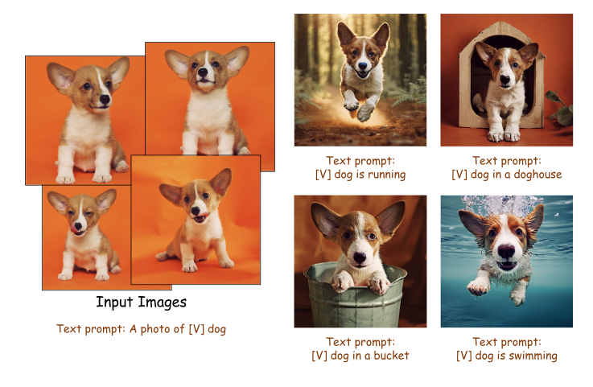

# 🔥 How to Train PixArt + Dreambooth
- PixArt + [Dreambooth](https://dreambooth.github.io/)
<div id="dreambooth" style="display: flex; justify-content: center;">
  
  
</div>

You **ONLY** need to change the **config** file in [config](../../configs/pixart_app_config/PixArt_xl2_img1024_dreambooth.py) and **dataloader** in [dataset](../../diffusion/data/datasets/Dreambooth.py).


The directory structure for Dreambooth dataset is:
```
cd ./data/dreambooth

dataset
├──dog6/
│  ├──00.jpg
│  ├──01.jpg
│  ├──......
├──cat/
│  ├──00.jpg
│  ├──01.jpg
│  ├──......

```

To get started, first install the required dependencies, then run on your local machine:

```bash
cd data/
git clone https://github.com/google/dreambooth.git

python -m torch.distributed.launch --nproc_per_node=1 --master_port=26666 train_scripts/train_dreambooth.py configs/pixart_app_config/PixArt_xl2_img1024_dreambooth.py --work-dir output/path
```


