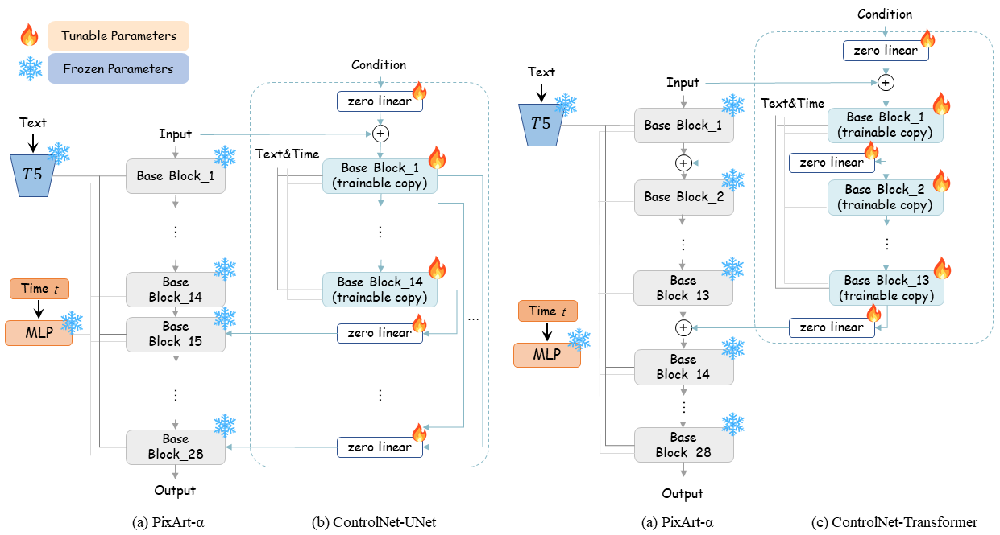

<!--Copyright 2023 The Huawei Noah’s Ark Lab Team. All rights reserved.

Licensed under the Apache License, Version 2.0 (the "License"); you may not use this file except in compliance with
the License. You may obtain a copy of the License at

http://www.apache.org/licenses/LICENSE-2.0

Unless required by applicable law or agreed to in writing, software distributed under the License is distributed on
an "AS IS" BASIS, WITHOUT WARRANTIES OR CONDITIONS OF ANY KIND, either express or implied. See the License for the
specific language governing permissions and limitations under the License.
-->


## 🔥 ControlNet
We incorporate a ControlNet-like(https://github.com/lllyasviel/ControlNet) module enables fine-grained control over text-to-image diffusion models. We introduce a novel ControlNet-Transformer architecture, specifically tailored for Transformers, achieving explicit controllability alongside high-quality image generation.

For more details about PixArt-ControlNet, please check the technical report [PixArt-δ](https://arxiv.org/abs/2401.05252).

<p align="center">
  
</p>


## Training the `PixArt + ControlNet` on your machine

```bash
# Train on 1024px
python -m torch.distributed.launch --nproc_per_node=2 --master_port=12345 train_scripts/train_controlnet.py configs/pixart_app_config/PixArt_xl2_img1024_controlHed.py --work-dir output/pixartcontrolnet-xl2-img1024

# Train on 512px
python -m torch.distributed.launch --nproc_per_node=2 --master_port=12345 train_scripts/train_controlnet.py configs/pixart_app_config/PixArt_xl2_img512_controlHed.py --work-dir output/pixartcontrolnet-xl2-img512
```

## Testing the `PixArt + ControlNet`
```bash
# Test on 1024px
DEMO_PORT= 12345 python app/app_controlnet.py configs/pixart_app_config/PixArt_xl2_img1024_controlHed.py --model_path path/to/1024px/PixArt-XL-2-1024-ControlNet.pth

# Test on 512px
DEMO_PORT= 12345 python app/app_controlnet.py configs/pixart_app_config/PixArt_xl2_img512_controlHed.py --model_path path/to/512px/pixart_controlnet_ckpt
```
Then have a look at a simple example using the http://your-server-ip:12345

